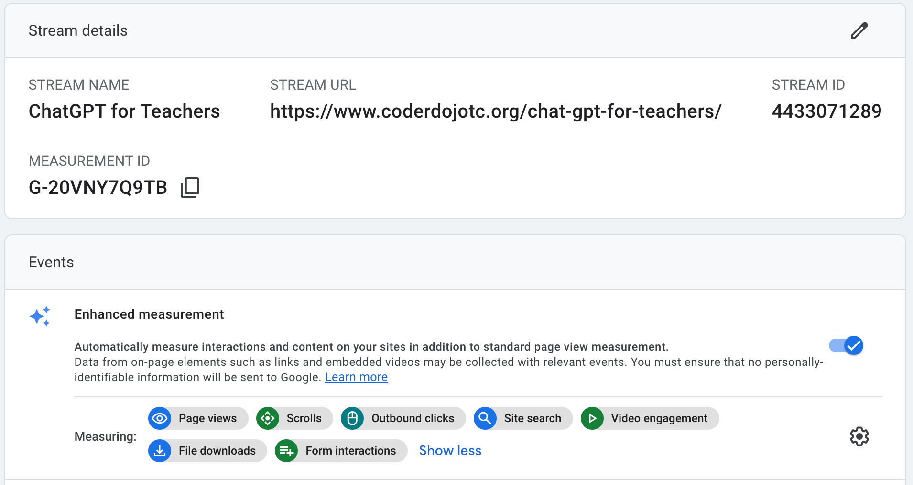
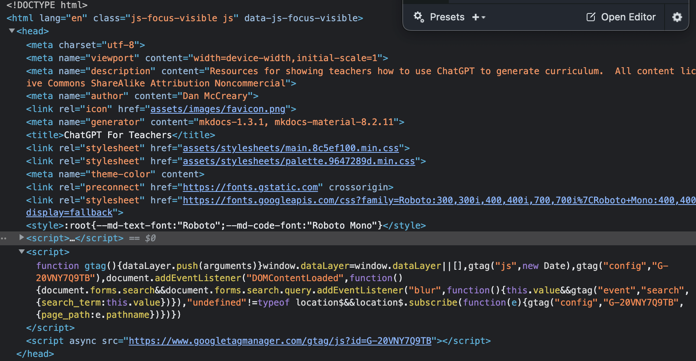

# Website Analytics

## Prompt
```
How do I track how many people are going to my website?
```

## Response

```
1. Use Google Analytics to track your website visitors. Google Analytics is a free web analytics service that allows you to measure your website’s traffic, visitor behavior and other important data. 

2. Use a web server log files to track website visitors. Web server log files provide detailed information about how many people are visiting your website, where they came from, and how they interacted with your website. 

3. Use a third-party website traffic monitoring service. There are many third-party services that offer website traffic monitoring, including Alexa, Compete and Quantcast. These services provide detailed information about the number of visitors to your website, where they came from, and how they interacted with your website.
```

## Prompt
```
How do use Use Google Analytics?
```

## Response

```
1. Create an Account: Sign up for a free Google Analytics account and connect your website to Google Analytics.

2. Install the Tracking Code: Install the Google Analytics tracking code on your website.

3. Set Goals: Set Goals in Google Analytics to measure and track the performance of your website.

4. Monitor Performance: Monitor the performance of your website by using the reporting features available in Google Analytics, including the real-time reports.

5. Track User Interactions: Track user interactions with your website by creating Events and setting up Site Search.

6. Analyze Your Data: Analyze your data by using the Advanced Segments feature in Google Analytics and create custom reports.

7. Optimize Your Site: Optimize your website by using the insights provided by Google Analytics and take corrective action if needed.
```

## Prompt

```
How do I install a Google Analytics Tracking Code on my website?
```

1. Sign in to your Google Analytics account and select the website you want to track.

2. Click on the Admin tab in the top navigation.

3. Select the account and property which you want to track.

4. Click on “Tracking Info” and then “Tracking Code”.

5. Copy the tracking code from the box in the pop-up window.

6. Paste the tracking code into the source code of your website. It should be placed immediately after the opening <head> tag.

7. Save your changes and test the tracking code on your website.

8. Refresh the page and check to make sure the tracking code is working correctly.

## Actual process

[mkdocs material site analytics](https://squidfunk.github.io/mkdocs-material/setup/setting-up-site-analytics/#configuration)

Open your mkdocs.yml and add the following lines

```yml
extra:
  analytics:
    provider: google
    property: G-HPYNX9B8QZ
```



!!! Note
  To use this feature, you must be on mkdocs-material [7.1.8](https://github.com/squidfunk/mkdocs-material/releases/tag/7.1.8) or later.

```sh
pip3 install --upgrade mkdocs-material
Successfully installed mkdocs-material-8.2.11 mkdocs-material-extensions-1.0.3 pygments-2.11.2 pymdown-extensions-9.1
```

## Verify Google Analytics

Use the Google Chrome More Tools -> Developer Tools -> Elements menus.

Then click on the <head> arrow to open the head element.  There you should see the Google Analytics scripts:

